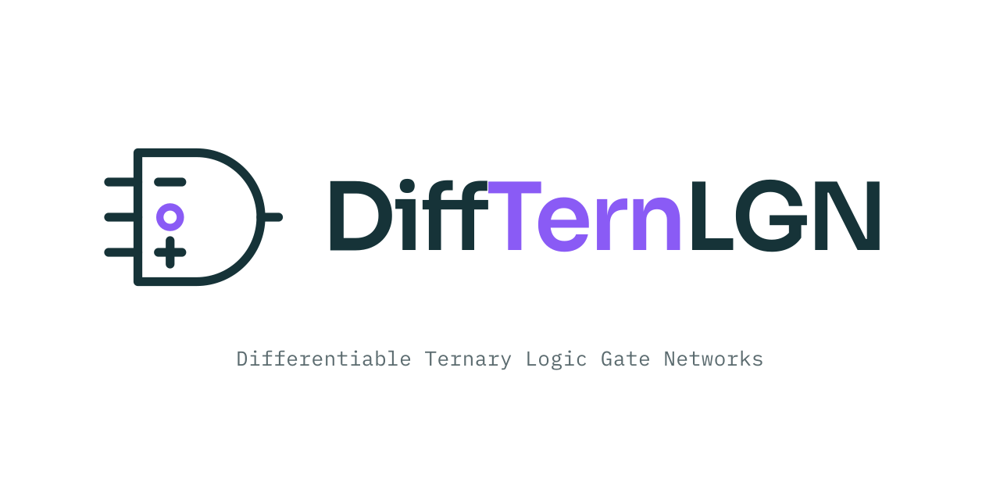

<p align="center">
  <picture>
    <source media="(prefers-color-scheme: dark)" srcset="assets/logo-dark.svg">
    
  </picture>
</p>

A JAX/Equinox framework for training networks of learnable ternary logic gates using continuous polynomial surrogates. Each neuron is a degree-(2,2) polynomial in two inputs that is discretized at inference time to one of 19,683 possible 2-input ternary gates.

## Key Idea

Standard differentiable logic gate networks learn a softmax distribution over a curated set of gates. PST-DTLGN instead parameterizes each neuron as a 9-coefficient polynomial that naturally spans the full space of ternary gates. A ternary commitment regularizer progressively drives the continuous polynomial toward a discrete gate during training — no gate vocabulary restriction needed.

**Training**: continuous polynomial neurons, gradient-based optimization via JAX autodiff.
**Inference**: discretized ternary truth-table lookup — just integer indexing, no arithmetic.

## Target Application

Learning **Signal Temporal Logic (STL)** specifications from trajectory data. The core library is application-agnostic.

## Project Structure

```
pst_dtlgn/
├── core/              Polynomial neuron, Vandermonde constants, 19,683-gate library, Fourier basis
├── network/           Layers, topologies (random sparse / butterfly / dilated), hardening to circuits
├── smoothing/         STE and Gaussian truth-table smoothing with anneal schedules
├── training/          Trainers, ternary commitment regularizer, lambda schedules
├── binary_baseline/   16-gate binary DLGN baseline for matched comparisons
├── analysis/          Gate census, hardening metrics, spectral analysis, benchmarks
├── data/              Binary/ternary encoding pipelines and dataset loaders
├── applications/stl/  STL predicates, labelers, dataset builders
└── viz/               Plotting helpers

final-notebooks/       Notebooks reproducing every experiment and figure
final-results/         Published figures (SVG/PDF) and result data
final-checkpoints/     Hardened circuits and per-run metrics
```

Scaling results span CIFAR-10/100 from 48K to 1M neurons over three seeds; per-run metrics
for every configuration are in [final-checkpoints/results.jsonl](final-checkpoints/results.jsonl).

## Requirements

- Python ≥ 3.10
- JAX, Equinox, Optax, NumPy (core)
- matplotlib, seaborn (visualization)
- Minari datasets, scikit-learn, PyTorch (data pipeline)
- See `pyproject.toml` for full dependency specification

## Setup

### Prerequisites

Install [uv](https://docs.astral.sh/uv/getting-started/installation/) (fast Python package manager):

```bash
curl -LsSf https://astral.sh/uv/install.sh | sh
```

### Local Development (macOS / CPU)

```bash
git clone https://github.com/sdamera95/DiffTernLGN.git && cd DiffTernLGN

# Create virtual environment and install with local dev extras
uv venv
uv sync --extra local
```

### GPU Workstation (Linux + CUDA 12)

```bash
git clone https://github.com/sdamera95/DiffTernLGN.git && cd DiffTernLGN

uv venv
uv sync --extra gpu
```

### Available Install Profiles

| Profile | Command | What it includes |
|---------|---------|-----------------|
| Core only | `uv sync` | JAX (CPU), Equinox, Optax, NumPy |
| Local dev | `uv sync --extra local` | Core + `viz` + `dev` + `data` |
| GPU | `uv sync --extra gpu` | Core + `cuda` + `viz` + `dev` + `data` |
| CUDA only | `uv sync --extra cuda` | Core + CUDA 12 JAX |
| Viz only | `uv sync --extra viz` | Core + matplotlib + seaborn |
| Tests only | `uv sync --extra dev` | Core + pytest + pytest-xdist + ipykernel |
| Data only | `uv sync --extra data` | Core + Minari + h5py + scikit-learn + torch/torchvision |

`uv.lock` is committed, so `uv sync` reproduces exact versions. Use `uv pip install -e ".[local]"` instead if you want an unpinned editable install.

### Switching Between CPU and GPU

JAX code is backend-agnostic — the same code runs on CPU and GPU without modification. The only difference is which packages are installed. To verify your backend:

```python
import jax
print(jax.devices())          # [CpuDevice(id=0)] or [CudaDevice(id=0)]
print(jax.default_backend())  # 'cpu' or 'gpu'
```

To switch an existing environment from CPU to GPU:

```bash
uv sync --extra cuda
```

## Verified Environment

Tested with the following versions (as of initial setup):

| Package | Version |
|---------|---------|
| Python | 3.12.7 |
| JAX | 0.9.0 |
| Equinox | 0.13.4 |
| Optax | 0.2.7 |
| MuJoCo | 3.5.0 |
| NumPy | 2.4.2 |

## Citation

If you use this work, please cite:

```bibtex
@article{damera2026polynomial,
  title   = {Polynomial Surrogate Training for Differentiable Ternary Logic Gate Networks},
  author  = {Damera, Sai Sandeep and Matheu, Ryan and Puranic, Aniruddh G. and Baras, John S.},
  journal = {arXiv preprint arXiv:2603.00302},
  year    = {2026},
  url     = {https://arxiv.org/abs/2603.00302}
}
```

## License

[MIT](LICENSE)
